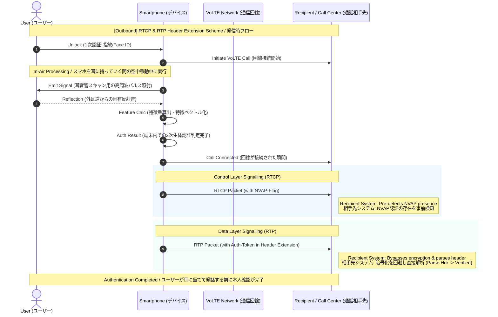
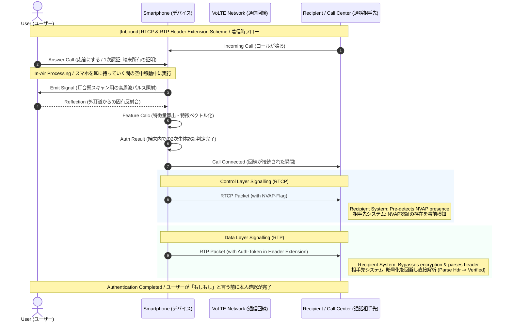

# NVAP: Protocol Sequence Diagrams (Outbound & Inbound)
## NVAP: プロトコルシーケンス図（発信時・着信時の詳細フロー）

[EN] This document defines the detailed signaling and data flow at the network layer for NVAP, covering both Outbound (User-initiated) and Inbound (Recipient-initiated) call scenarios. By leveraging RTP/RTCP Header Extensions, NVAP achieves true multi-factor authentication (MFA) with zero user friction.

[JP] 本ドキュメントでは、NVAPにおける「発信時（ユーザー起点）」と「着信時（相手先起点）」の両方のシナリオにおける、ネットワークレイヤーの詳細なシグナリングとデータフローを定義します。RTP/RTCPヘッダー拡張を活用することで、ユーザーの手間を一切増やすことなく、強固な多要素認証（MFA）を完全に無音で実現します。

---

## 1. Outbound Call Scenario (User-initiated) / 発信時のシーケンス

[EN] In this scenario, the primary factor is established via manual device unlock, followed by automated ear acoustic scanning while moving the phone to the ear.

[JP] ユーザーが自ら電話をかけるシーンです。第1要素として手動のデバイスロック解除（Unlock）を行い、その後、スマホを耳に持っていく間の空中移動中に自動で耳音響スキャンを実行します。

---

## 2. Inbound Call Scenario (Recipient-initiated) / 着信時のシーケンス

[EN] In this scenario, device ownership (Possession) is automatically verified by answering the call, eliminating the need for a manual password/Face ID unlock. Multi-factor authentication is perfectly satisfied by combining "Device Possession" and "Ear Biometrics."

[JP] 相手（銀行やコールセンター等）から電話がかかってくるシーンです。手動の画面ロック解除を必要とせず、「応答ボタンを押す（端末を所持している証明）」＋「耳音響スキャン（生体認証）」の組み合わせにより、ボタン一発で強固な多要素認証（MFA）が美しく成立します。

---

## 3. Technical Comparison / 両シナリオの技術的特徴

### Outbound Call (発信時)
* **[EN]** Uses manual lock screen entry (Fingerprint/Face ID) as the 1st factor (Possession/Knowledge) to explicitly initiate a secure call.
* **[JP]** 発信時の1次認証として、手動での画面ロック解除（指紋/Face ID）を利用し、安全な通話の開始を明示的にトリガーします。

### Inbound Call (着信時)
* **[EN]** The act of answering the ringing phone on the specific target hardware serves as the 1st factor (Possession). This bypasses the friction of a manual screen unlock while maintaining strict cryptographic multi-factor security.
* **[JP]** 特定の電話番号（端末）に宛てられた着信に対して「応答ボタンを押す」という行為そのものを1次認証（所持認証）とみなします。これにより、ユーザーに画面ロック解除の手間を一切意識させることなく、高度な多要素セキュリティを維持します。
